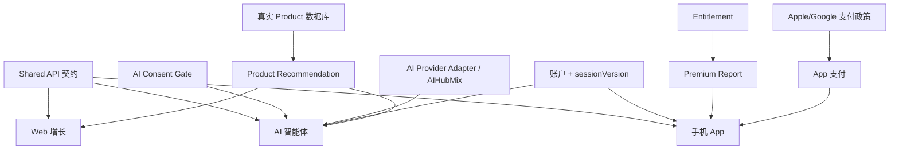

# GB MEDIX AI — Parallel Development Roadmap

编制：Claude Code（Lead Developer）　|　日期：2026-07-10　|　分支：`plan/mobile-agent-parallel-roadmap`　|　基线 `origin/main` = `750f119`

> **本轮仅规划文档。** 不改业务代码、不改 Prisma Schema、不建 migration、不改生产配置、不合并 `main`。品牌统一 **GB MEDIX AI**。
>
> 标签约定：**EXISTING**（代码中已存在，经检查）· **PLANNED**（本次规划、尚未实现）· **BLOCKED**（被外部/依赖阻塞）· **REQUIRES_DECISION**（需 ChatGPT/用户决策）。禁止把 PLANNED 写成 EXISTING。

---

## 1. 当前系统基线（基于真实代码检查）

生产 `https://ai.gbmedix.com`；GitHub `mdshahin677546-ops/gb-medix-ai-platform`；本地 `E:\GB医疗AI问诊+供应链`。

| 能力 | 状态 | 依据 |
|---|---|---|
| Next.js 14 App Router + React 18 + TypeScript | EXISTING | `package.json`、`app/**` |
| Tailwind CSS | EXISTING | `tailwind.config.ts` |
| Prisma + PostgreSQL/Neon | EXISTING | `prisma/schema.prisma`（postgresql） |
| Vercel 部署 | EXISTING | `vercel.json`、生产在线 |
| Stripe（Checkout + Webhook） | EXISTING | `app/api/checkout`、`app/api/webhooks/stripe` |
| Resend 邮件 | EXISTING | `lib/email/*`、`EMAIL_PROVIDER=resend` |
| AIHubMix 中转 + 模型路由 | EXISTING（生产配置） | `DEEPSEEK_BASE_URL` 指向中转；隐私说明已披露 |
| DeepSeek Provider Adapter（OpenAI-compatible） | EXISTING | `lib/ai/providers/openai-compatible.ts`、`provider-factory.ts`（代码默认 `deepseek-chat`；生产 `DEEPSEEK_MODEL=baidu-deepseek-v4-pro`） |
| 邮箱验证 | EXISTING | `app/api/auth/{send-verification,verify-email}`、`EmailVerification` 模型 |
| AI Consent Gate | EXISTING | `lib/ai-consent/*`、`app/api/ai-consent/*`、`AIProcessingConsent` 模型 |
| Free / Premium Report | EXISTING | `app/api/reports/generate`、`reports/[id]`、`AIReport`、`lib/report-schema.ts` |
| Payment / Entitlement（含退款撤权） | EXISTING | `Entitlement`/`PaymentRecord`、`lib/entitlement/*`、webhook 撤权 |
| `sessionVersion` 会话吊销 | EXISTING | `User.sessionVersion`、`lib/auth.ts` |
| 结构化输出健壮化（顶层单对象 + Zod + 安全 502 + 诊断 allowlist） | EXISTING | `openai-compatible.ts`、`lib/ai/diagnostics.ts`（main `a54f8f7`/`750f119`） |
| 生产小流量运行 | EXISTING | 公开面 200 |
| 现有模型 | EXISTING | `User, Merchant, Product, TCMRecord, PaymentRecord, RFQRecord, AssistantSession, Doctor, ConsultationOrder, Entitlement, AIUsage, AIProcessingConsent, DoctorVerification, PatientConsent, Conversation, Message, AIReport, ProductRecommendation, EmailVerification` |
| `Conversation` / `Message` 模型 | EXISTING（基础表已在） | 多轮 Agent 运行/状态/审计模型（`AgentRun` 等）为 PLANNED |
| `/api/v1/` 版本化 / `/api/mobile/*` | PLANNED | 现有路由在 `app/api/**`，无版本前缀/移动端口 |
| `familyMemberId` 家庭档案 | PLANNED | 模型中不存在 |
| CI（`.github/workflows`） | BLOCKED / REQUIRES_DECISION | **无 CI 工作流**，建议补建（见 §7） |
| 完整 i18n 目录 | PLANNED | 现为 `lib/lang.ts` 简单方案 |

> 产品定位：多语言 AI 健康管理 · AI 智能健康问诊 · 个性化健康报告 · 健康产品与供应链 · 中医体质 + 现代生活方式。**禁止**：疾病诊断 / 自动处方 / 治疗承诺 / 疾病概率预测 / 自动分诊结论 / 替代医生。

---

## 2. 四条并行工作线

### A. 生产盈利线
保持生产 `main` 稳定；继续小流量真实收费；**只优先修复阻断类**（5xx、邮件、支付、AI、认证、权限、数据安全）。P0 优先于一切新功能。

### B. Web 增长线 — `feature/sprint-2a-growth-conversion`
Analytics 埋点 · 漏斗分析 · Landing 优化 · 注册转化 · 评估完成率 · Free→Premium 转化 · Stripe Checkout 转化 · 支付解锁 · 邮件自动触达 · 报告复访 · 多语言 · 产品推荐入口。

**事件（至少）**：`landing_view · signup_start · signup_complete · email_verified · assessment_start · assessment_complete · free_report_view · premium_click · checkout_start · payment_success · report_unlocked · refund`。

每个事件定义：触发位置 · 必要字段 · **禁止上传的健康敏感字段**（问卷答案/睡眠/情绪/身体感受原文、报告原文、email、userId）· 去重规则 · 服务端 vs 客户端边界 · 转化漏斗定义 · 最小 Dashboard。全部 PLANNED。

### C. 手机 App 线 — `feature/mobile-app-foundation`
RN · Expo · TS · Expo Router · EAS Build · SecureStore。硬约束：**不是 WebView 壳** · 不另建账户/数据库 · 不直调 AIHubMix/DeepSeek/OpenAI · 不直连 PostgreSQL · 统一调用 GB MEDIX AI 后端 API。详见 `MOBILE_APP_IMPLEMENTATION_PLAN.md`。全部 PLANNED。

### D. AI 智能体线 — `feature/ai-consultation-agent`
单轮/简单问答升级为：多轮 · 可追踪 · 可恢复 · 可审计 · Web/App 共用 · 健康管理而非诊断。详见 `AI_AGENT_CONSULTATION_PLAN.md`。（`Conversation/Message` EXISTING；运行/状态/审计模型 PLANNED。）

### E. 共享契约线 — `feature/shared-api-contract`
固定 Web/App/Agent 共用账户、Consent、Conversation、Report、Entitlement、Product、AIUsage、Provider 契约与 `/api/v1/`。详见 `SHARED_WEB_MOBILE_API_CONTRACT.md`。

**为何契约必须优先/同步**：App 与 Agent 都消费同一套认证/错误码/Report/Entitlement/Consent 语义；不先冻结会各自定义 DTO 与错误码导致分叉返工。故契约线 W1 先冻结错误码 + 认证 + 基础类型，其余接口与三线同步细化。

---

## 3. 四周执行安排

> 每项：Owner（执行=Claude Code，审=Codex，验收=ChatGPT）· 依赖 · 交付物 · 验收 · 是否影响 DB · 是否高风险。

### Week 1（地基）
| 任务 | 线 | 依赖 | 交付物 | 验收 | DB | 高风险 |
|---|---|---|---|---|---|---|
| Analytics 基础 + 漏斗事件 | Web | — | 事件表+实现 | 12 事件可采、无敏感字段 | 否 | 中 |
| Expo 工程 + API Client + Auth + SecureStore + 导航 | App | 契约草案 | `apps/mobile`+`packages/*` 骨架 | Expo 启动、类型贯通 | 否 | 中 |
| `Conversation/Message` 设计 + Intake + Safety | Agent | 契约草案 | Agent 设计稿+状态机骨架 | Safety 拦截生效 | 否（设计） | 高 |
| 错误码 + 认证 + 基础类型契约冻结 | Shared | — | 契约文档+契约测试骨架 | Codex 通过、码固定 | 否 | 高 |

### Week 2
| 任务 | 线 | 依赖 | 交付物 | 验收 | DB | 高风险 |
|---|---|---|---|---|---|---|
| Landing+Premium+邮件触达优化 | Web | W1 埋点 | Web 改动 | 漏斗可对比 | 否 | 中 |
| 登录+邮箱验证+Consent+AI 对话+评估 | App | 契约冻结 | mobile 页面 | 与 Web 同门禁/结果 | 否 | 高 |
| TCM Wellness+Lifestyle Plan+多轮摘要 | Agent | Agent 模型评审 | agent 实现 | 多轮可跑、摘要正确 | 是（评审 migration） | 高 |
| Report+Consent+Conversation 契约 | Shared | W1 契约 | 契约细化 | Codex 通过 | 否 | 高 |

### Week 3
| 任务 | 线 | 依赖 | 交付物 | 验收 | DB | 高风险 |
|---|---|---|---|---|---|---|
| 产品推荐入口+留存 | Web | Product 契约 | Web 改动 | 仅真实 Product | 否 | 中 |
| Free/Premium Report+历史+用户中心+多语言+Beta Build | App | Report 契约 | mobile 页面+EAS Beta | Premium 经 Entitlement、IDOR 安全 | 否 | 高 |
| Follow-up+7 天计划+Product Recommendation | Agent | W2 | agent 实现 | 回访可追踪、不虚构商品 | 是（评审） | 高 |
| Entitlement+Product+AIUsage 契约 | Shared | W2 | 契约细化 | Codex 通过 | 否 | 高 |

### Week 4（联调+测试+Beta）
| 任务 | 线 | 依赖 | 交付物 | 验收 | DB | 高风险 |
|---|---|---|---|---|---|---|
| Web/App/Agent 联调 | 全 | 三线产物 | 联调报告 | Web 起、App 续、状态一致 | 否 | 高 |
| 权限/数据隔离/安全/性能测试 | 全 | 联调 | 测试报告 | IDOR/隔离/限流全绿 | 否 | 高 |
| Beta 用户测试 + 受控 App 内测 | App | EAS Beta | 内测反馈 | iOS/Android 可装 | 否 | 中 |

任一周触发线上 P0，按生产盈利线规则**优先处置生产**，排期顺延。

---

## 4. 依赖关系

Shared API ← App/Agent/Web；Agent ← Consent + Provider + 账户；Premium Report ← Entitlement；Product Recommendation ← 真实 Product DB；App 支付 ← Apple/Google 政策（REQUIRES_DECISION）。

---

## 5. 风险登记表

| 风险 | 等级 | 触发条件 | 预防 | 检测 | 回滚 | 负责人 |
|---|---|---|---|---|---|---|
| Web/App 认证割裂 | 高 | 两端各建 session | 统一 `sessionVersion`+共享契约 | 契约测试 | 回退 App auth 分支 | Claude Code |
| Consent 状态不一致 | 高 | 端各存 consent | 后端唯一真相、统一 Gate | 一致性测试 | 强制读后端 | Claude Code |
| Premium 权益绕过 | 高 | 端内判断权益 | Entitlement 后端强校验(402) | IDOR/权益测试 | 关闭端内解锁 | Codex 审 |
| AI 诊断化 | 高 | 输出诊断/处方 | medicalSafetyPrompt+Safety Agent | 质量测试集 | 拦截并回退 prompt | Claude Code |
| App Store 数字内容支付合规 | 高 | App 内售数字内容 | Beta 不内置数字购买 | 政策评审 | 移除购买入口 | REQUIRES_DECISION |
| Prisma migration 冲突 | 中 | 并行分支各改 schema | migration 单独评审、串行 | `migrate status` | 恢复快照 | Codex 审 |
| 多分支并行冲突 | 中 | 高风险代码跨分支复制 | 契约先行、禁止未审复制 | PR 审 | rebase/还原 | Codex |
| 健康数据泄露 | 高 | 日志/埋点含健康原文 | 数据最小化+allowlist 日志 | 日志审计 | 撤下泄露路径 | Claude Code |
| Provider 输出非法 JSON | 中 | 中转/模型坏 JSON | 顶层单对象+Zod+安全 502 | 单测覆盖 | 保持安全 502 | EXISTING 已缓解 |
| 产品推荐虚构商品/功效 | 高 | 模型自造 SKU/功效 | 只从真实 Product DB | 推荐测试 | 关闭推荐 | Codex 审 |
| Analytics 上传敏感健康数据 | 高 | 埋点带健康字段 | 埋点字段 allowlist | 埋点审计 | 停用事件 | Claude Code |
| 生产与开发配置串用 | 高 | 功能分支改生产配置 | 功能分支禁改生产配置 | 配置审查 | 还原配置 | Codex 审 |

---

## 6. 分支与审核策略
- `main` **仅保留生产稳定版本**，仅接受 Codex 审核通过的改动。
- 公共 Schema **migration 必须独立审核**（不夹带功能 PR）。
- **Stripe/Auth/Entitlement/Consent/AIReport 必须 Codex 审核**。
- 不允许未经审核**跨分支复制高风险代码**。
- **禁止 force push `main`**；共享分支禁止 `reset --hard` / `push --force[-with-lease]`。
- 每条分支独立测试 + 报告。

## 7. REQUIRES_DECISION / BLOCKED 汇总
- **CI 缺失**：无 `.github/workflows`，建议补建（tsc/test/build 门禁）——需 ChatGPT 定优先级。
- **App 内数字内容支付**：Apple IAP / Google Play Billing / Stripe 分工需法律 + 商店政策确认。
- **familyMemberId 家庭档案**：需 schema 决策（migration 单独评审）。
- **`/api/v1/` 迁移节奏**：是否引入 BFF、弃用期限待确认。
