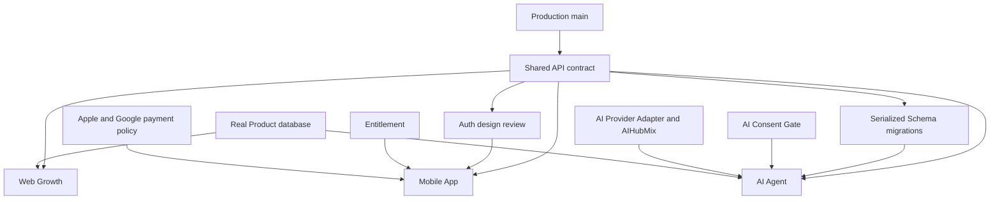

# GB MEDIX AI — Parallel Development Roadmap

编制：Claude Code（Lead Developer）　|　日期：2026-07-10　|　分支：`plan/mobile-agent-parallel-roadmap`　|　基线 `origin/main` = `750f119`

> **本轮仅规划文档。** 不改业务代码、Prisma Schema、migration、生产配置，不合并 `main`。品牌统一 **GB MEDIX AI**。

**Status legend**
- `EXISTING_CODE`：可由当前仓库代码验证。
- `PLANNED`：尚未实现的设计。
- `BLOCKED`：在指定前置条件满足前不得实施。
- `REQUIRES_DECISION`：需要产品、法律、平台或架构决定。
- `UNVERIFIED_PRODUCTION_CONFIGURATION`：据项目运行记录存在，但无法仅通过仓库验证。

---

## 1. 当前系统基线

生产 `https://ai.gbmedix.com`；GitHub `mdshahin677546-ops/gb-medix-ai-platform`；本地 `E:\GB医疗AI问诊+供应链`。

### 1a. 仓库可验证代码事实（EXISTING_CODE）
| 能力 | 依据 |
|---|---|
| Next.js 14 App Router + React 18 + TypeScript | `package.json`、`app/**` |
| Tailwind CSS | `tailwind.config.ts` |
| Prisma + PostgreSQL 目标 | `prisma/schema.prisma`（provider=postgresql） |
| Vercel 兼容部署结构 | `vercel.json`、`next.config.mjs` |
| Stripe 集成（Checkout + Webhook）代码 | `app/api/checkout`、`app/api/webhooks/stripe` |
| Resend 邮件发送实现路径 | `lib/email/*`、`EMAIL_PROVIDER` 读取逻辑 |
| OpenAI-compatible Provider Adapter | `lib/ai/providers/openai-compatible.ts` |
| DeepSeek provider 可配置 | `lib/ai/provider-factory.ts` |
| **代码默认模型 `deepseek-chat`** | `provider-factory.ts`（`DEEPSEEK_MODEL || AI_MODEL || "deepseek-chat"`） |
| 邮箱验证实现 | `app/api/auth/{send-verification,verify-email}`、`EmailVerification` 模型 |
| AI Consent Gate | `lib/ai-consent/*`、`app/api/ai-consent/*`、`AIProcessingConsent` 模型 |
| Free / Premium Report | `app/api/reports/generate`、`reports/[id]`、`AIReport`、`lib/report-schema.ts` |
| Payment / Entitlement（含退款撤权代码） | `Entitlement`/`PaymentRecord`、`lib/entitlement/*`、webhook 撤权 |
| `sessionVersion` 会话吊销 | `User.sessionVersion`、`lib/auth.ts` |
| 结构化输出健壮化（顶层单对象 + Zod + 安全 502 + 诊断 allowlist） | `openai-compatible.ts`、`lib/ai/diagnostics.ts` |
| 现有模型 | `User, Merchant, Product, TCMRecord, PaymentRecord, RFQRecord, AssistantSession, Doctor, ConsultationOrder, Entitlement, AIUsage, AIProcessingConsent, DoctorVerification, PatientConsent, Conversation, Message, AIReport, ProductRecommendation, EmailVerification` |
| `Conversation` / `Message` 基础表 | schema（多轮 Agent 运行/状态/审计 `AgentRun` 等为 PLANNED） |

### 1b. 生产平台环境事实（UNVERIFIED_PRODUCTION_CONFIGURATION）
```text
UNVERIFIED_PRODUCTION_CONFIGURATION:
根据既有项目运行记录，生产环境据报使用 Vercel、Resend、AIHubMix 和
baidu-deepseek-v4-pro，但这些生产平台配置不能仅通过当前 Git 仓库验证。
进入任何依赖这些配置的实施任务前，平台负责人必须提供去敏后的环境变量名、
部署状态或平台截图/日志证明；不得在代码审查中将其视为已验证事实。
```
具体未验证项：Vercel 当前实际部署状态 · 当前生产环境变量值 · `EMAIL_PROVIDER=resend` · `DEEPSEEK_BASE_URL` 实际生产值（指向 AIHubMix）· `DEEPSEEK_MODEL=baidu-deepseek-v4-pro` · 当前生产真实流量状态 · 生产邮件/支付/AI 成功率。

### 1c. 待实施 / 阻塞 / 待决策
| 项 | 状态 |
|---|---|
| `/api/v1/` 版本化 / `/api/mobile/*` | PLANNED |
| `familyMemberId` 家庭档案 | PLANNED |
| 完整 i18n 目录（现为 `lib/lang.ts`） | PLANNED |
| CI（`.github/workflows`，仓库无） | REQUIRES_DECISION |
| DeviceSession / Agent 运行模型 | BLOCKED（见各专项文档，需 Codex PASS + 独立 migration） |

> 产品定位：多语言 AI 健康管理 · AI 智能健康问诊 · 个性化健康报告 · 健康产品与供应链 · 中医体质 + 现代生活方式。**禁止**：疾病诊断 / 自动处方 / 治疗承诺 / 疾病概率预测 / 自动分诊结论 / 替代医生。

---

## 2. 四条并行工作线

### A. 生产盈利线
保持生产 `main` 稳定；继续小流量真实收费；**只优先修复阻断类**（5xx、邮件、支付、AI、认证、权限、数据安全）。P0 优先于一切新功能。

### B. Web 增长线 — `feature/sprint-2a-growth-conversion`
Analytics 埋点 · 漏斗分析 · Landing 优化 · 注册转化 · 评估完成率 · Free→Premium 转化 · Stripe Checkout 转化 · 支付解锁 · 邮件自动触达 · 报告复访 · 多语言 · 产品推荐入口。事件与去重见 §9。全部 PLANNED。

### C. 手机 App 线 — `feature/mobile-app-foundation`
RN · Expo · TS · Expo Router · EAS Build · SecureStore。硬约束：不是 WebView 壳 · 不另建账户/数据库 · 不直调 Provider · 不直连 PostgreSQL · 统一调用后端 API。移动认证受**强制安全基线（BLOCKED）**约束，详见 `MOBILE_APP_IMPLEMENTATION_PLAN.md` §6。PLANNED。

### D. AI 智能体线 — `feature/ai-consultation-agent`
单轮升级为多轮/可追踪/可恢复/可审计/Web-App 共用/健康管理而非诊断。详见 `AI_AGENT_CONSULTATION_PLAN.md`。

### E. 共享契约线 — `feature/shared-api-contract`
固定共用账户/Consent/Conversation/Report/Entitlement/Product/AIUsage/Provider 契约与 `/api/v1/`。**契约先行**（W1 冻结错误码 + 认证 + 基础类型），避免三线各自定义 DTO/错误码分叉。详见 `SHARED_WEB_MOBILE_API_CONTRACT.md`。

---

## 3. 四周执行安排

> 每项：Owner（执行=Claude Code，审=Codex，验收=ChatGPT）· 依赖 · 交付物 · 验收 · 是否影响 DB · 是否高风险。

### Week 1（地基）
| 任务 | 线 | 依赖 | 交付物 | 验收 | DB | 高风险 |
|---|---|---|---|---|---|---|
| Analytics 基础 + 漏斗事件（含去重） | Web | — | 事件表+实现 | 12 事件可采、无敏感字段、幂等 | 否 | 中 |
| Expo 工程 + API Client + 导航（**不实现真实 Token 签发**） | App | 契约草案 | `apps/mobile`+`packages/*` 骨架 | Expo 启动、类型贯通 | 否 | 中 |
| `Conversation/Message` 设计 + Intake + Safety | Agent | 契约草案 | Agent 设计稿+状态机骨架 | Safety 拦截生效 | 否（设计） | 高 |
| 错误码 + 认证 + 基础类型契约冻结 | Shared | — | 契约文档+契约测试骨架 | Codex 通过、码固定 | 否 | 高 |

### Week 2
| 任务 | 线 | 依赖 | 交付物 | 验收 | DB | 高风险 |
|---|---|---|---|---|---|---|
| Landing+Premium+邮件触达优化 | Web | W1 埋点 | Web 改动 | 漏斗可对比 | 否 | 中 |
| 登录+邮箱验证+Consent+AI 对话+评估（**需 Auth 基线 Codex PASS**） | App | Auth 设计审 | mobile 页面 | 与 Web 同门禁/结果 | 否 | 高 |
| TCM Wellness+Lifestyle Plan+多轮摘要 | Agent | Agent 模型评审 | agent 实现 | 多轮可跑、摘要正确 | 是（评审 migration） | 高 |
| Report+Consent+Conversation 契约 | Shared | W1 契约 | 契约细化 | Codex 通过 | 否 | 高 |

### Week 3
| 任务 | 线 | 依赖 | 交付物 | 验收 | DB | 高风险 |
|---|---|---|---|---|---|---|
| 产品推荐入口+留存 | Web | Product 契约 | Web 改动 | 仅真实 Product | 否 | 中 |
| Free/Premium Report+历史+用户中心+多语言+Beta Build | App | Report 契约 | mobile 页面+EAS Beta | Premium 经 Entitlement、IDOR 安全 | 否 | 高 |
| Follow-up+7 天计划+Product Recommendation | Agent | W2 | agent 实现 | 回访可追踪、不虚构商品 | 是（评审） | 高 |
| Entitlement+Product+AIUsage 契约 | Shared | W2 | 契约细化 | Codex 通过 | 否 | 高 |

### Week 4（联调+测试+Beta）
| 任务 | 线 | 依赖 | 交付物 | 验收 | DB | 高风险 |
|---|---|---|---|---|---|---|
| Web/App/Agent 联调 | 全 | 三线产物 | 联调报告 | Web 起、App 续、状态一致 | 否 | 高 |
| 权限/数据隔离/安全/性能测试 | 全 | 联调 | 测试报告 | IDOR/隔离/限流全绿 | 否 | 高 |
| Beta 用户测试 + 受控 App 内测 | App | EAS Beta | 内测反馈 | iOS/Android 可装 | 否 | 中 |

任一周触发线上 P0，**优先处置生产**，排期顺延。

---

## 4. 依赖关系



依赖表：Shared API ← App/Agent/Web；Agent ← Consent + Provider + 账户；Premium Report ← Entitlement；Product Recommendation ← 真实 Product DB；App 支付 ← Apple/Google 政策（REQUIRES_DECISION）。

---

## 5. 风险登记表

| 风险 | 等级 | 触发条件 | 预防 | 检测 | 回滚 | 负责人 |
|---|---|---|---|---|---|---|
| Web/App 认证割裂 | 高 | 两端各建 session | 统一 `sessionVersion`+共享契约 | 契约测试 | 回退 App auth 分支 | Auth owner |
| Consent 状态不一致 | 高 | 端各存 consent | 后端唯一真相、统一 Gate | 一致性测试 | 强制读后端 | Consent owner |
| Premium 权益绕过 | 高 | 端内判断权益 | Entitlement 后端强校验(402) | IDOR/权益测试 | 关闭端内解锁 | Entitlement owner |
| AI 诊断化 | 高 | 输出诊断/处方 | medicalSafetyPrompt+Safety Agent | 质量测试集 | 拦截并回退 prompt | Agent owner |
| App Store 数字内容支付合规 | 高 | App 内售数字内容 | Beta 不内置数字购买 | 政策评审 | 移除购买入口 | REQUIRES_DECISION |
| Prisma migration 冲突 | 中 | 并行分支各改 schema | migration 单独评审、串行 | `migrate status` | 恢复快照 | Schema owner |
| 多分支并行冲突 | 中 | 高风险代码跨分支复制 | 契约先行、禁止未审复制 | PR 审 | rebase/还原 | Codex |
| 健康数据泄露 | 高 | 日志/埋点含健康原文 | 数据最小化+allowlist 日志 | 日志审计 | 撤下泄露路径 | Claude Code |
| Provider 输出非法 JSON | 中 | 中转/模型坏 JSON | 顶层单对象+Zod+安全 502 | 单测覆盖 | 保持安全 502 | EXISTING_CODE 已缓解 |
| 产品推荐虚构商品/功效 | 高 | 模型自造 SKU/功效 | 只从真实 Product DB | 推荐测试 | 关闭推荐 | Agent owner |
| Analytics 上传敏感健康数据 | 高 | 埋点带健康字段 | 埋点字段 allowlist + eventId | 埋点审计 | 停用事件 | Claude Code |
| 生产与开发配置串用 | 高 | 功能分支改生产配置 | 功能分支禁改生产配置 | 配置审查 | 还原配置 | Codex |

---

## 6. 分支与审核策略
- `main` **仅保留生产稳定版本**，仅接受 Codex 审核通过的改动。
- 公共 Schema **migration 必须独立审核**（不夹带功能 PR）。
- **Stripe/Auth/Entitlement/Consent/AIReport 必须 Codex 审核**。
- 不允许未经审核**跨分支复制高风险代码**。
- **禁止 force push `main`**；共享分支禁 `reset --hard` / `push --force[-with-lease]`。
- 每条分支独立测试 + 报告。

---

## 7. Parallel Branch Conflict Matrix and Ownership

| 工作线组合 | 共享模块/潜在冲突 | 风险 | 唯一所有者 | 消费方允许 | 消费方禁止 | 推荐合并顺序 |
|---|---|---:|---|---|---|---|
| Web Growth vs Shared API | DTO、错误码、Analytics API | Medium | Shared API | 调用稳定接口、加页面埋点 | 私自复制 DTO、另建错误码 | Shared API 基础先合并 |
| Mobile vs Shared API | Auth、Token、DTO、API Client | High | Shared API/Auth owner | 建 UI 和调用 Client | 自建 Auth、直改后端认证 | Auth 契约审查后 Mobile |
| Agent vs Shared API | Conversation、Consent、Report DTO | High | Shared API | 消费契约、实现 Agent service | 私自定义同名 DTO/API | Shared API 后 Agent |
| Mobile vs Agent | Conversation UI、Message DTO | Medium | Shared API + Agent backend | Mobile 展示和发送请求 | Mobile 实现 Agent 逻辑 | Agent API 后联调 |
| Agent vs Prisma | Agent 模型与现有 Conversation/Message | High | Schema/Migration owner | 提交模型提案 | 各分支独立 migration | 串行 migration PR |
| Mobile Auth vs Web Auth | sessionVersion、用户状态 | High | Auth owner | 消费统一身份服务 | 改写 Web Cookie 逻辑 | Auth 设计先审 |
| Stripe vs App Payments | Entitlement、撤权、支付来源 | High | Entitlement/Payment owner | 读取统一权益 | 客户端直接解锁 | 来源模型先审 |
| i18n vs Mobile | 语言 key、共享文案 | Medium | Shared i18n owner | 使用已发布 key | 各端创建冲突 key | Shared i18n 后消费 |

**唯一所有权**
```text
Shared API branch owns: API DTO · 统一错误结构 · 错误码 · API version policy · api-client contract · shared Zod schemas · shared i18n keys
Auth owner owns:        Web/App 身份边界 · Access Token · Refresh Session · sessionVersion integration · DeviceSession design
Consent owner owns:     Consent service · Consent versioning · Consent revoke behavior · Provider gate
Entitlement/Payment owner owns: Entitlement lifecycle · Stripe mapping · Apple/Google future mapping · refund/revoke/expire semantics
Schema/Migration owner owns:    Prisma Schema · migration naming/order · migration conflict resolution
```
- Feature 分支不得复制 Shared API 实现。
- 同一时间只能有一个公共 Schema migration PR 进入审核。
- 高风险 Auth/Consent/Entitlement 变更不得由多个分支并行实现。
- Shared API 可先落**纯类型、错误码和无数据库改动**的契约；任何 Schema 实现拆为独立 PR。

**推荐合并顺序**
```text
1. Shared API：纯契约、DTO、错误码、API Client 骨架，不改数据库
2. Mobile：工程骨架、导航、静态 UI，不实现真实 Token 签发
3. Web Growth：无敏感数据 Analytics 基础和页面优化
4. Auth 独立设计/Schema PR，经 Codex PASS
5. Agent 数据模型独立 Schema PR，经 Codex PASS
6. Agent 服务实现
7. Mobile Auth 和 Agent 联调
8. Payment/Entitlement 多来源扩展独立 PR
```

---

## 8. EntitlementSource and Unified Lifecycle（PLANNED）

> 仅规划，不改 Schema。**当前 `Entitlement` 未含 `source` 字段**，以下为规划枚举，不得声称已存在。

**EntitlementSource（候选枚举）**：`stripe · apple · google · admin · promotion`。
统一字段（规划，最终以独立 Schema 审核为准）：`source · sourceReferenceId · productCode · resourceType · resourceId · status · startsAt · expiresAt · revokedAt · revokeReason · cancelAtPeriodEnd · environment · verifiedAt`。
统一状态：`pending · active · expired · revoked · refunded · disputed · cancelled`。

**来源映射**：Stripe（成功后由服务端或已验签 webhook 激活；refund/dispute 撤权；客户端不能直接声明支付成功）· Apple（服务端验 App Store 交易/通知；receipt/transaction 仅待验证输入；未验证不激活）· Google（服务端验 Purchase Token；客户端 token 仅待验证输入；未验证不激活）· Admin（仅受审计后台授予，记录操作者/原因/有效期，不可客户端调用）· Promotion（须 campaign/reference + 起止时间 + 防重复兑换 + 可撤销）。

**统一撤权原则**：`refund · chargeback/dispute · revocation · subscription expiration · admin revoke · promotion expiration · fraud/security action` 任一发生都更新统一 Entitlement。App/Web **只读统一 Entitlement**，不直接读支付渠道结果作为最终权限。**支付事实 ≠ 权益事实；客户端购买成功提示 ≠ 服务端权益已激活；Consent ≠ Entitlement。**

---

## 9. Analytics Event Identity and Deduplication（PLANNED）

**通用事件结构**
```json
{
  "eventName": "payment_success",
  "eventId": "服务端或客户端生成的去敏唯一事件标识",
  "occurredAt": "ISO timestamp",
  "source": "web|mobile|server",
  "sessionKey": "短期匿名或去敏会话标识",
  "schemaVersion": 1
}
```
**Analytics 禁止上传字段（denylist）** —— 以下一律不得进入 Analytics：
```text
- email
- 明文 userId
- 用户姓名或直接身份信息
- 完整 IP
- Cookie
- Session
- Access Token
- Refresh Token
- Authorization Header
- API Key
- paymentId
- Stripe Checkout Session ID
- Stripe PaymentIntent ID
- refundReference 原文
- reportId
- entitlementId
- conversationId
- assessmentId
- 数据库内部 ID 原文
- 健康评估答案
- 症状或身体感受原文
- AI 对话正文
- Prompt 原文
- AI Provider 输出原文
- Report 正文或报告内容
- 健康计划正文
- SafetyEvent 健康描述原文
- request body
- response body
- 完整数据库对象
```
**认证信息必须逐项禁止（不得只写泛化"认证信息"）**：`Cookie` · `Session Cookie` · `Access Token` · `Refresh Token` · `Authorization Header`。

**报告内容禁止**：`Report 正文` · `报告摘要原文` · `报告建议原文` · `报告中的健康数据`。`report_unlocked` 事件**可记录的仅为**：`report_unlocked = true` · `report_type = free|premium` · `schemaVersion` · 去敏 `eventId` · `occurredAt` · `source`。**不得记录报告内容。**

**最小化 + HMAC secret 服务端专有**：Analytics 只能接收最小化、去敏、不可逆或受控 HMAC 后的事件标识及业务状态。HMAC 使用的 event secret 只能保存在**服务端安全配置**中，**不得**发送到客户端、Analytics 平台、日志或 Git。

**去敏 ID 规则**：Analytics 只接收 HMAC 后结果，不接收内部原始 ID；HMAC secret 不进入客户端；HMAC 结果**不得**用于 API 资源访问或权限判断；Analytics `eventId` 只用于统计去重；**不得将去敏 Analytics ID 当作认证标识**。

**服务端为准事件去重键**（`HMAC(event-secret, ...)`，文档不暴露真实 secret，Analytics 只收去敏结果）：
- `payment_success` → `HMAC(secret,"payment_success:"+internalPaymentId+":"+paymentStateVersion)`；Stripe webhook 可能重放，用支付处理层幂等结果，同一状态迁移只记一次。
- `report_unlocked` → `HMAC(secret,"report_unlocked:"+entitlementId+":"+reportId)`；仅首次 locked→unlocked。
- `refund` → `HMAC(secret,"refund:"+refundReference+":"+refundStateVersion)`；同一退款状态迁移只记一次。
- `checkout_start` → `HMAC(secret,"checkout_start:"+checkoutIntentId)`；checkoutIntentId 服务端创建，不上传 Stripe Session ID，页面重复渲染不重复创建。
- `assessment_complete` → `HMAC(secret,"assessment_complete:"+assessmentId+":"+completionVersion)`；只记完成状态，不记答案，重复提交只记一次有效完成。

**客户端事件**（如 `landing_view`）：`UUIDv4 eventId + 短期匿名 sessionKey`；一次有效展示只发一次；客户端重试用同一 eventId；服务端/ingestion 层按 eventId 去重；**不将长期设备指纹作为 Analytics 身份**。

**必须由服务端产生或确认**：`signup_complete · email_verified · assessment_complete · payment_success · report_unlocked · refund`。客户端不得作为最终事实来源。

---

## 10. REQUIRES_DECISION / BLOCKED 汇总
- **CI 缺失**（无 `.github/workflows`）：是否补建 tsc/test/build 门禁及优先级。REQUIRES_DECISION。
- **App 内数字内容支付**：Apple IAP / Google Play Billing / Stripe 分工（法律 + 商店政策）。REQUIRES_DECISION。
- **familyMemberId / DeviceSession / Agent 模型**：单独 migration 评审 + Codex PASS。BLOCKED。
- **`/api/v1/` 迁移**：是否引入 BFF、弃用期限。REQUIRES_DECISION。
- **生产平台配置**：见 §1b，实施前需平台负责人提供去敏证据。
